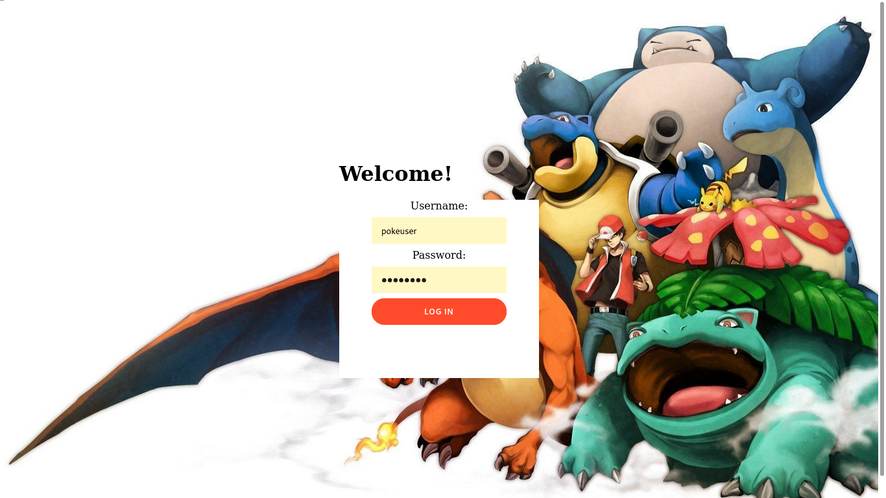
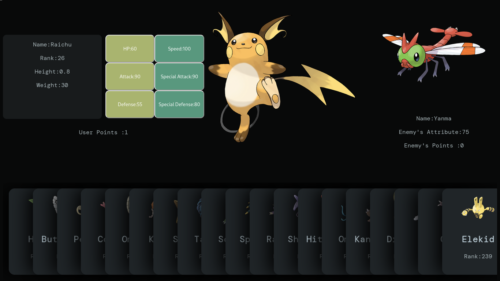

# PokeTCG

A Pokemon trading card game made using JavaScript at front-end and Django in backend.

## Screenshots






## Getting Started

These instructions will get you a copy of the project up and running on your local machine for development and testing purposes. 

### Prerequisites

```
Python >= 3.*
SQLite 
Chromium / Firefox
```

### Installing

Clone the repository

```
git clone https://github.com/sud7535/PokeTCG
```

Download the zip file from the following link and extract it in the static folder: [Link](https://drive.google.com/file/d/1ncVv2f0_12C5bJgzIr_iVrXtGNsqKZhH/view?usp=sharing) 

```
tar xzf *path_to_zip* *path_to_project_root*/backend/static/
```

It should be done so that the img/ folder in zip resides in the static/ folder, and all the images inside the img/ folder

## Running the app

To run:

```
python manage.py runserver
```

## Built With

* [Django](https://www.djangoproject.com/) - The web framework used
* [Pokemon Fandom](https://pokemon.fandom.com) - Image source

## Authors

* **Sudarshan Dodiya** - *Initial Work* - [sud7535](https://github.com/sud7535)

See also the list of [contributors](https://github.com/sud7535/PokeTCG/contributors) who participated in this project.

## License

This project is licensed under the MIT License - see the [LICENSE.md](LICENSE.md) file for details


